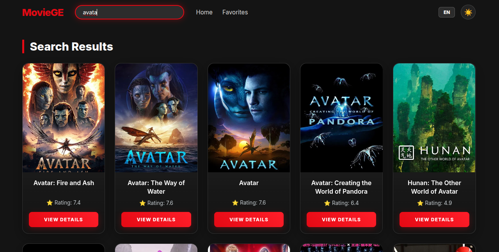
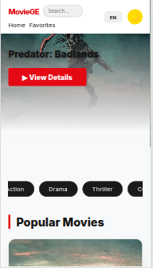

# 🎬 MovieGE - Modern Movie Platform(ფილმების პლატფორმა)

**MovieGE** არის თანამედროვე, რეაქტიული (React.js) ვებ-გვერდი, რომელიც იყენებს **TMDB API**-ს ფილმების მონაცემების გამოსაჩენად. პროექტი შექმნილია მომხმარებლის საუკეთესო გამოცდილებისთვის (UX), აქვს დახვეწილი დიზაინი და მრავალფეროვანი ფუნქციონალი.

---

## ძირითადი ფუნქციონალი (Key Features)

* **მრავალმხრივი API ინტეგრაცია:** Axios-ის მეშვეობით ხდება პოპულარული, ტოპ-რეიტინგული, ძებნადი და ჟანრების მიხედვით გაფილტრული ფილმების წამოღება.
* **Context-Like State Management:** ენისა და თემის სინქრონიზაცია მთელ აპლიკაციაში LocalStorage-ის გამოყენებით.
* **Dynamic Routing:** დეტალური გვერდები (`/movie/:id`) დინამიური პარამეტრების გამოყენებით.
* **Advanced UI:** * **Dual-Theme:** სრულყოფილი Dark და Light რეჟიმები CSS Variables-ის გამოყენებით.
    * **Internationalization (i18n):** სრული მხარდაჭერა ქართულ და ინგლისურ ენებზე.
    * **Custom Modals:** დამატებისა და წაშლის დადასტურების ფუნქციონალი `React Portals`-ს მსგავსი ლოგიკით.
* **UX დეტალები:** პაგინაცია, ჟანრების ჰორიზონტალური ფილტრი, Glassmorphism დიზაინი და Smooth ანიმაციები.

---

## 🛠️ გამოყენებული ტექნოლოგიები (Tech Stack)

* **Library:** React.js (Functional Components, Hooks)
* **Routing:** React Router v6
* **HTTP Client:** Axios
* **Styling:** CSS3 (Flexbox, Grid, Variables, Keyframes)
* **Storage:** Window LocalStorage API
* **API:** The Movie Database (TMDB)

---

## 📸 სქრინშოთები (Screenshots)



|  |  |  |
---

## პროექტის სტრუქტურა (Project Structure)

```text
src/
├── components/         # განმეორებადი კომპონენტები (Navbar, MovieCard, Pagination, Modal, GenreFilter)
├── pages/              # მთავარი გვერდები (Home, Details, Favorites)
├── assets/             # სტატიკური ფაილები
├── translations.js     # ლექსიკონი KA/EN ენებისთვის
├── App.js              # როუტინგი და გლობალური სთეითი
└── index.css           # გლობალური სტილები და CSS ცვლადები (Themes)

## ინსტალაცია და გაშვება

1. დააკლონირეთ რეპოზიტორი.
2. გაუშვით `npm install` ბიბლიოთეკების დასაინსტალირებლად.
3. გაუშვით `npm start` პროექტის ლოკალურად ჩასართავად.
4. `npm run build` - პროდუქციული ვერსიის ასაწყობად.
